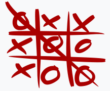
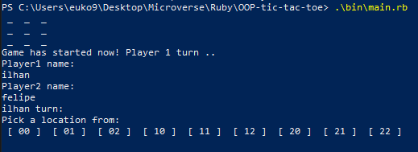
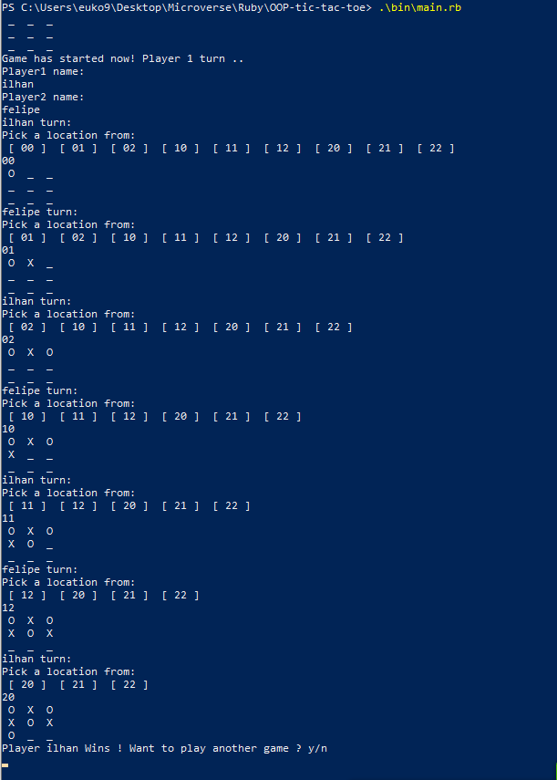

<!--
*** Thanks for checking out this README Template. 
-->

<!-- PROJECT TITLE -->

 
<h1 align="center">Tic Tac Toe game</h1>

<!-- TABLE OF CONTENTS -->

## Table of Contents

* [About the Project](#about-the-project)
  * [How to play](#how-to-play)
* [Getting Started](#getting-started)
* [License](#license)
* [Contact](#contact)
* [Acknowledgements](#acknowledgements)

<!-- ABOUT THE PROJECT -->
## About The Project

Tic-tac-toe (American English), noughts and crosses (British English), or Xs and Os is a paper-and-pencil game for two players, X and O, who take turns marking the spaces in a 3×3 grid. The player who succeeds in placing three of their marks in a horizontal, vertical, or diagonal row is the winner.

For more information acess: <a href="https://en.wikipedia.org/wiki/Tic-tac-toe">wiki</a> 

### How to play

1. You need to put the name of the players
2. The game will show the possibilities and you have to put the coordinates. 
  Coordinates are x and y values on the game board. Starts with 00(x:0 y:0) and goes until 22(x:2 y:2)   Example: 00
3. And you play until someone win or draw(Screenshot of a win case is below)

    

4. You can also restart the game by input "y" to terminal command which comes right after the game ends.

<!-- GETTING STARTED -->
## Getting Started

1. Clone or download the project 
2. Acess to the folder whith your terminal
3. Run this command: bin/main.rb 

<!-- LICENSE -->
## License

Distributed under the MIT License. See `LICENSE` for more information.

<!-- CONTACT -->
## Contact
* Felipe Enne - felipeenne@gmail.com  
* Ilhan Sönmez - ilhansnmz44@gmail.com 

<!-- ACKNOWLEDGEMENTS -->
## Acknowledgements

* Microverse.
